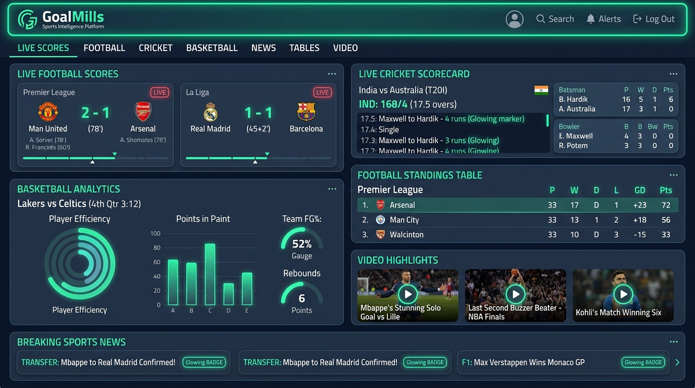
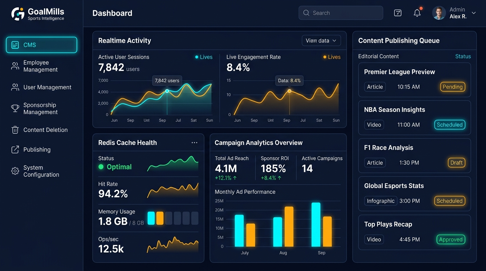
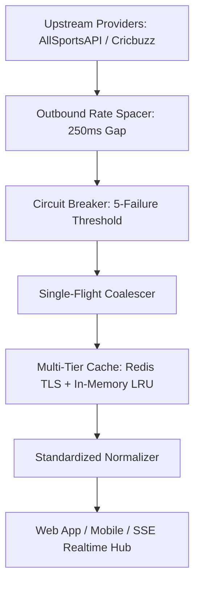

<div align="center">

# ⚡ GoalMills — Next-Generation Sports Intelligence & Operations Platform

[](https://nextjs.org/)
[](https://www.typescriptlang.org/)
[](https://redis.io/)
[](https://www.mongodb.com/)
[](https://golang.org/)
[](https://turbo.build/)
[](https://vitest.dev/)

**GoalMills** is a sports intelligence, real-time livescore streaming, editorial CMS, and business operations platform engineered for scale, resilience, sub-millisecond response latency, and bulletproof security.

[Live Sports Engine](#-live-sports-intelligence-engine) • [Admin Hub](#-enterprise-admin-hub--operations-portal) • [Architecture](#-monorepo-architecture) • [Security & Resilience](#-security--fault-tolerance) • [Author & Legal](#-author--intellectual-property-rights)

---



</div>

---

## 👨‍💻 Author & Intellectual Property Rights

| Attribute | Details |
| :--- | :--- |
| **Principal Author & Architect** | **Ekpenisi Erue Raphael** |
| **Platform Organization** | **GoalMills** |
| **Platform Version** | **3.0.0 (Production Release Candidate)** |
| **Monorepo Repository** | `eerapheal/goalmills` |

### 🔒 Strict Proprietary Rights & Ownership Notice

> **IMPORTANT & EXCLUSIVE NOTICE:**  
> **All rights reserved.** This software, codebase, architecture, design system, algorithms, data normalization engines, microservices, and all related intellectual property are the **exclusive proprietary property of Ekpenisi Erue Raphael and GoalMills**.  
>  
> **NO INDIVIDUAL, ENTITY, OR THIRD PARTY HAS ANY RIGHT, LICENSE, OR PERMISSION TO COPY, MODIFY, DISTRIBUTE, REPRODUCE, SUBLICENSE, DECOMPILE, EXTRACT, OR CREATE DERIVATIVE WORKS FROM ANY PIECE OR PART OF THIS CODEBASE** without the express, prior written authorization and direct consent from **Ekpenisi Erue Raphael** and **GoalMills**. Unauthorized usage, mirroring, or exploitation is strictly prohibited and subject to full civil and criminal legal enforcement.

---

## 🏆 Platform Overview

GoalMills bridges real-time sports intelligence with business workflows:

1. **Public Sports Intelligence Web App (`apps/web`)**: Next.js App Router application delivering live match timelines, ball-by-ball cricket scorecards, basketball quarter analytics, standings tables, video highlights, breaking editorial news, and Server-Sent Events (SSE) live updates.
2. **Enterprise Admin Operations Hub (`apps/admin`)**: Operations dashboard structured into **7 primary workflows** for complete editorial and staff governance.
3. **Cross-Platform Mobile App (`apps/mobiles`)**: React Native / Expo application consuming normalized sports APIs with synchronized sponsorship banners.
4. **Go High-Throughput Mailer (`services/mailer`)**: Go 1.23+ microservice featuring priority queues, DKIM signing, bounce management, and suppression lists.

---

## 🖥️ Enterprise Admin Hub & Operations Portal



The Admin Operations Hub is structured into **7 primary workflows**:

```text
┌──────────────────────────────────────────────────────────────────────────────────────────────────┐
│                                       GOALMILLS ADMIN HUB                                        │
│  [ CMS ] [ Employee Mgmt ] [ User Mgmt ] [ Sponsorship Mgmt ] [ Deletion ] [ Publishing ] [ System ] │
└──────────────────────────────────────────────────────────────────────────────────────────────────┘
```

1. **CMS & Editorial (`/` / `/news` / `/videos`)**:
   - Entity-First rich publishing engine linking articles and video highlights to sports, leagues, clubs, and players.
   - Cloudinary image and video integration with automated WebP transformations.
2. **Employee Management (`/employees`)**:
   - Staff directory, role delegations, onboarding checklists, training modules, and performance evaluations.
3. **User Management (`/users`)**:
   - Subscriber management, activity telemetry, role adjustments, and security status.
4. **Sponsorship Management (`/sponsorships`)**:
   - Campaign creation, placement targeting (home hero, news mid-roll, match banner), budget caps, and impression/click analytics.
5. **Content Deletion & Trash Bin (`/deletion`)**:
   - Soft-deletion recovery pipelines, permanent purge workflows (Super-Admin only), and audit trail tracking.
6. **Publishing Workflows (`/publishing`)**:
   - Editorial review, scheduling, approval pipelines, and breaking news banners.
7. **System Configuration & Diagnostics (`/system`)**:
   - Multi-tier Redis latency monitors (ms), cache hit ratios %, stampede reduction metrics, database health, and one-click distributed cache flushing.

---

## ⚽ Live Sports Intelligence Engine

GoalMills unifies multiple external sports providers behind an internal normalization layer:



### Active Sports
- **⚽ Football**: Premier League, UEFA Champions League, La Liga, Serie A, Bundesliga, World Cup. Real-time scores, lineups, standings, H2H analysis, form guides, and live events (goals, VAR, bookings).
- **🏏 Cricket**: ICC Tournaments, IPL, Test/ODI/T20 series. Live smart scorecards (`runs/wickets (overs)`), ball-by-ball commentary, ICC team & player rankings, and series stats.
- **🏀 Basketball**: NBA, EuroLeague, international tournaments. Live period gamecast, quarter breakdowns (Q1–Q4, Overtime), team box scores, and efficiency ratings.

### Future Sports (Isolated behind "Coming Soon" states)
- **🎾 Tennis**, **⚾ Baseball**, **🏒 Hockey** (Pre-architected, zero fake mock data).

---

## 🛡️ Security & Fault Tolerance

```text
======================================================================
SECURITY AUDIT SCORE: 97 / 100
======================================================================
✔ Strict Server-Side RBAC (6 Roles: user, contributor, staff, editor, manager, super-admin)
✔ NoSQL Injection Defense (24-char ObjectId regex validation across all query boundaries)
✔ Anti-XSS Sanitization & React DOM escaping across all user and CMS inputs
✔ SSRF URL whitelisting preventing cloud metadata and private IP egress
✔ Production Headers (Strict-Transport-Security, X-Content-Type-Options, X-Frame-Options)
✔ Guarded Telemetry (20 req/min/IP rate limit + 10s impression deduplication)
✔ Zero Exposed Credentials in public client bundles or repository source code
======================================================================
```

---

## ⚡ Multi-Tier Caching & Provider Resilience

GoalMills features a multi-tier cache engine combining **Redis Cloud** and an **in-memory bounded LRU fallback**:

- **Sub-Millisecond Response Times**: `< 1ms` memory cache hits, `2–5ms` Redis cluster hits.
- **Single-Flight Request Coalescing (`singleFlight`)**: 100% of concurrent burst misses for identical expired keys are merged into **exactly one upstream fetch**, protecting provider quotas.
- **Circuit Breaker**: Automatically bypasses failing providers after 5 consecutive errors for 30s, gracefully serving stale cached data with `isStale: true` freshness stamps.
- **250ms Fetch Rate Spacer**: Outbound interval protection eliminating 429 burst rate-limiting.

---

## 🏗️ Monorepo Architecture

```text
goalmills/
├── apps/
│   ├── web/                     # Public Next.js 16+ Web Platform (SEO, SSE, Livescores)
│   │   ├── src/app/             # App Router pages (/news, /highlights, /docs, /sitemap.xml)
│   │   ├── src/components/      # UI components & real-time SSE listener
│   │   └── src/lib/             # Multi-tier Redis cache, normalizers, socketBroadcaster
│   ├── admin/                   # Authenticated Next.js 16+ Operations Hub
│   │   ├── src/app/             # 7 primary tabs (CMS, Employees, Users, Sponsors, Deletion, Publishing, System)
│   │   └── src/lib/             # ServerAuth RBAC, AuditLogger, RedisCache
│   └── mobiles/                 # Cross-platform Expo / React Native App
│       └── src/screens/         # Mobile screens (SportTabs, Livescores, News, Sponsors)
├── services/
│   └── mailer/                  # High-performance Go 1.23+ SMTP/DKIM Microservice
├── packages/
│   ├── ui/                      # Shared design tokens & dark-mode components
│   ├── types/                   # Shared TypeScript domain contracts
│   └── config/                  # Shared linting & build configurations
└── docs/                        # Complete technical specifications & verification reports
```

---

## 🚀 Quick Start & Installation

### Prerequisites
- **Node.js**: `>= 20.0.0`
- **pnpm**: `>= 9.0.0`
- **Go**: `>= 1.23` (for mailer service)
- **MongoDB Atlas** or local MongoDB
- **Redis** (optional; memory fallback activates automatically)

### 1. Clone & Install Dependencies
```bash
git clone https://github.com/eerapheal/goalmills.git
cd goalmills
pnpm install
```

### 2. Configure Environment Variables
Copy `.env.example` to `apps/web/.env` and `apps/admin/.env`:
```bash
cp .env.example apps/web/.env
cp .env.example apps/admin/.env
```

Key environment variables:
```env
MONGODB_URI=mongodb+srv://...
REDIS_URL=rediss://...
NEXTAUTH_SECRET=your-secure-random-32-char-secret
NEXT_PUBLIC_APP_URL=https://goalmills.com
FOOTBALL_API_KEY=your_allsports_key
CRICKET_API_KEY=your_cricbuzz_key
BASKETBALL_API_KEY=your_allsports_key
```

### 3. Run Development Workspaces
```bash
# Run all workspaces simultaneously
pnpm dev

# Or run specific applications
pnpm --filter web dev       # Web app at http://localhost:3000
pnpm --filter admin dev     # Admin hub at http://localhost:3001
pnpm --filter mobile start  # Expo development server
```

### 4. Run Test Suites & Typechecks
```bash
# Run full Vitest suite (57 test files, 168 tests)
pnpm --filter web test
pnpm --filter admin test

# Run Go mailer tests
cd services/mailer && go test ./... && go vet ./...

# Run strict TypeScript typecheck
pnpm --filter web typecheck
pnpm --filter admin typecheck

# Production compilation verification
pnpm --filter web build
pnpm --filter admin build
```

---

## 📊 Technical Verification & Reports

All production verification reports are documented in `/docs`:
- [Production Readiness Scorecard (96/100)](docs/production-readiness.md)
- [Security Final Report & Threat Model](docs/security-final-report.md)
- [Performance & Web Vitals Audit](docs/performance-final-report.md)
- [SEO & Schema.org JSON-LD Report](docs/seo-final-report.md)
- [E2E & Chaos Failure Drill Report](docs/e2e-test-report.md)
- [Load Testing & Concurrency Analysis](docs/load-test-report.md)
- [Production Release Checklist](docs/production-release-checklist.md)
- [Phase 3 Master Hardening Report](docs/phase-3-report.md)

---

## 📄 License & Proprietary Notice

**Copyright © 2026 Ekpenisi Erue Raphael & GoalMills. All Rights Reserved.**  
*Strictly Private & Proprietary. No part of this software may be reproduced, distributed, or utilized without written authorization.*
